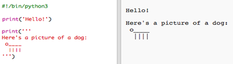
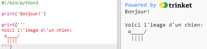
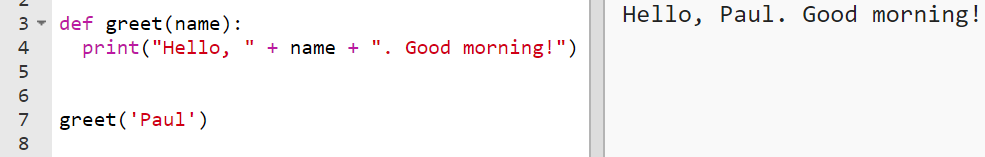
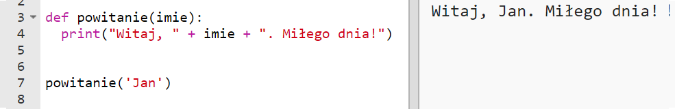
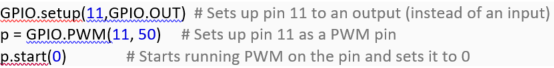

# Translating Python

Python is a popular object-oriented programming language, often used for web and app development. Generally, Python code **should not be translated** with the exception of **identifiers** (i.e. names given to **variables**, **functions**, **classes**), **strings**, and **comments**.

## Strings

String is a sequence of characters, created with single quotes, double quotes or triple quotes:

- The strings **Hello** and **Here’s a picture of a dog…** should be translated because they will be displayed when the learner runs the programme so it’s important for them to understand what it says.

- If we keep the strings in English, the learner won’t understand what the printed message means. As a rule, the text that’s within **single** ('xx'), **double** ("xx") or **triple** quotes ('''xx''') **should be translated**.
 
- The function print() (and all other Python functions) should not be translated because if it is, the code won’t work.
 
## Variables

Variables are used to store information and to access it. Programmer chooses names of variables so they **should be translated** to make them more meaningful to learners. 

- For example, we can create a variable called **_name_** and assign it the value **_Larry_**. We can then ask Python to print the variable **_name_** and it will display **_Larry_** (on the right hand side):
 
 
 
- The variable name **should be translated** (but please remember not to use any of your language’s special characters):
 
 
 
- You can also translate the value of the variable (here, **_Larry_**) if it’s a string (i.e. if it’s between single/double/triple quotes) to make it more meaningful to the learners:
 
 
 
   - However, please remember that the value of a variable could be a **built-in Python function**, in which case it **should not be translated**. For example:
 
 
 
You can find a list of buil-in functions [here](https://www.programiz.com/python-programming/methods/built-in).

Please remember that Python is case-sensitive. This means that `variable` and `Variable` are not the same.
 
## Functions

Functions are defined by users and perform the defined task when they are called. Names of functions **should be translated** to make them more meaningful to learners. 

- For example, we can create a function that displays a personalised greeting. When we call the function and specify a name (e.g. **_Paul_**), Python will display the message:

 
 
 - The function name in the above screenshot (`greet`), as well as the parameter `name` and the strings `Hello` and `Good morning!`, **should be translated** (but please remember not to use any of your language’s special characters). The built-in function `print` and the keyword `def` (see below for more on keywords) **should not be translated**. This is what a translated function looks like:
 
  

Please remember that Python is case-sensitive. This means that `function` and `Function` are not the same.

## Comments

Comments are used by programmes to give more details about a given line of code; they are marked with the # sign. These **should be translated**.

## Do not translate

It is crucial that you do not translate the following Python keywords:

False 
class 
finally 
is 
return 
None 
continue 
for 
lambda 
try 
True 
def 
from 
nonlocal 
while 
and 
del 
global 
not 
with 
as 
elif 
if 
or 
yield 
assert 
else 
import 
pass 
break 
except 
in 
raise

