# How to use Crowdin

To translate and review project instructions, you are going to use Crowdin.

## I need to set up a Crowdin account

You can do this in three easy steps:

1. Go to [crowdin.com](https://crowdin.com/) and click **Sign Up**. You will be asked for an email address, username, and password. Please use the same email address that you use to contact us, and make sure your username consists of your first name and surname (e.g. name.surname, name_surname).

2. After clicking **CREATE ACCOUNT**, you will be taken to this screen:

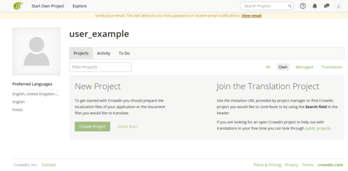

Click the icon in the top right-hand corner of the screen (see image below), and choose **Settings** to go to your account settings. Add your full name, and from **My Languages**, select only your native language(s) (if English is your native language, please select your most fluent foreign languages).

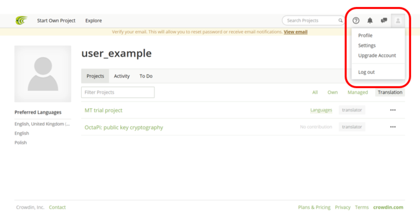

3.	Go to your email inbox — you should have received a verification email from Crowdin (check your spam folder if you can’t see one). Follow the instructions in the email to verify your account.

## I already have a Crowdin account

If you’re already signed up to Crowdin account, feel free to use your existing account. However, so that we can verify your contributions, **please make sure** your full name or the email address we have for you is recorded somewhere in your account settings.

## Using Crowdin to help us with our projects

Once you have your account set up and verified, you can start translating and/or reviewing:

1. When you click the **Link for Translation** or **Link for Review** in the Task Manager, you will be  taken to the project’s Crowdin page:

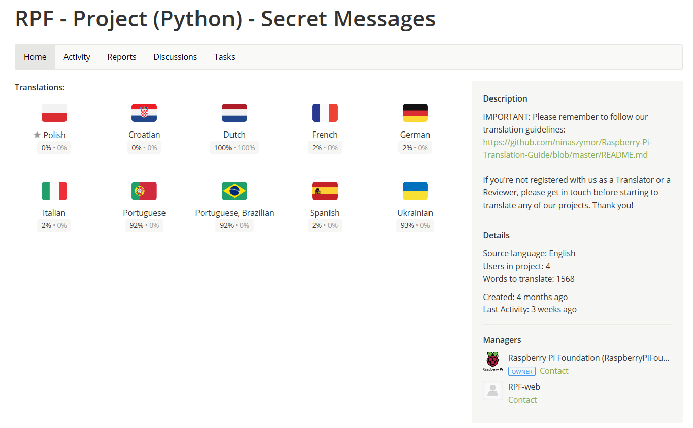

You will see language icons in the form of flags:
 - If your language is listed under **Needs Translation**, the project needs to be translated from scratch. You can open it in Translation Mode (see below).
 - If your language is listed under **Translated, but needs to be Voted**, the project has been pre-translated using Google Translate and needs to be post-edited. You can open it in Translation Mode (see below).
 - If your language is listed under **Translated, but needs to be Validated**, the translation for this project is complete and needs to be reviewed. You can open it in Proofreading Mode (see below).
 
2. Click the icon for your language, and you will be taken to a screen looking like the image below. Here you’ll find all the files within the project that need translating (we explain how to approach translating the different types of files [here](https://github.com/ninaszymor/Raspberry-Pi-Translation-Guide/blob/master/Tools/Files%20in%20Crowdin.md) - please **read this carefully**). Note the progress bars on the right, which indicate the progress of translation (blue) or review (green).

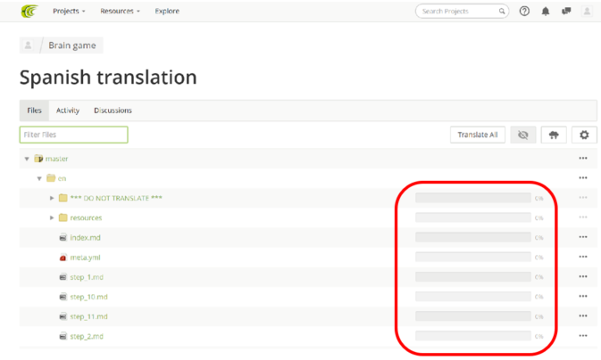

## Translating and post-editing files (for Translators)

To translate or post-edit a file, open it in **Translation Mode**: click the three dots next to your chosen file’s progress bar and select **Translate**. You will know something has been pre-translated with machine translation because the progress bar will be blue.

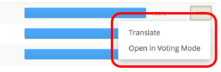

You will be taken to Crowdin Editor:

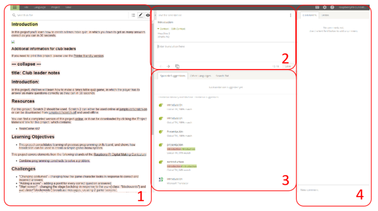

In the left-hand panel (1), you will see the English source text. The heading of the section to be translated is highlighted in yellow (here it is ‘Introduction’), and the segments of the text that are not yet translated are highlighted in red.

1. Click on a segment to select it for translation. The selected segment will appear in the top middle panel (2), which is the translation area where you can add/edit the translation. 

+ If you're post-editing machine translation and you think the translation is OK, please approve it by clicking the + sign. If you think the translation is incorrect, click the - sign and change the traslation to what you think it should be.

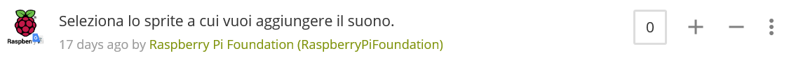

+ Sometimes, machine translation will translate things that should be left in English, such as code, tags, brand names, etc., so please remember to follow our [instructions](https://github.com/ninaszymor/Raspberry-Pi-Translation-Guide/blob/master/Tools/Files%20in%20Crowdin.md).

2. Some words in the translation area might be underlined with a dotted line, which means that there is a glossary entry for that word:

Hover over the word with your mouse to see the suggestion. It might be a tip on how to translate the word, or a reminder for you that the word should not be translated:

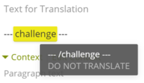

3. When you’re happy with your translation, click **Save**. As soon as you translate and save a segment, its colour in the left-hand panel will change to green:

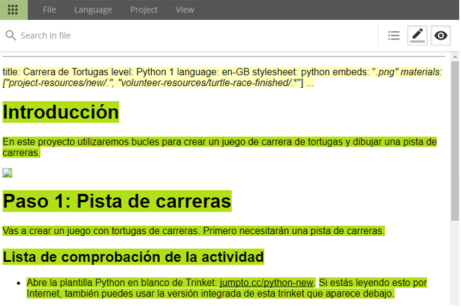

4. The next segment of the text will automatically appear in the translation area. If the segment is untranslatable (for example, it’s a name of a file or a URL), you can click the **Copy source** icon at the bottom of the translation area: 

5. The bottom panel in the middle of the screen (3) offers you suggestions for your translation, which are based on our previous translations, Crowdin global translation memory, or machine translation. Feel free to use the suggestions, but please be careful and always review them, as they may contain errors or may be unsuitable for your context. Click on a suggestion to select it, and it will be added to the translation area automatically.

6. You can add comments or questions relating to a given segment in the panel on the right (4).

7. After you translate and save the last segment in the file, the following pop-up window will appear:

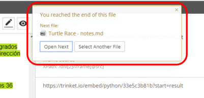

Clicking **Open Next** will open the next file in the folder, while clicking **Select Another File** will allow you to select a different file from the folder. To continue working on the current file, close the window by clicking on the X in its top right-hand corner.

8. Once you are done, you can exit the Crowdin Editor by clicking the green icon in the top left-hand corner of the screen:

9. Some file types (e.g. .sb2) cannot be translated within the Crowdin Editor and therefore need to be downloaded. To download a file, click on its name as usual. You’ll be taken to the Crowdin Editor, and as you won’t be able to translate the file there, download it by clicking Download in the upper right-hand corner (see the image below). Then translate it on your computer, and upload it back to Crowdin.

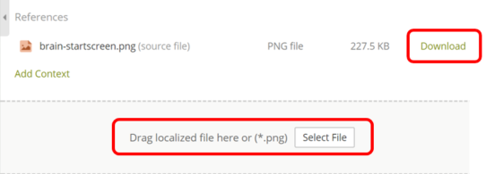

## Reviewing files (for Reviewers)

Once the translation of a file is finished, its progress bar will be blue:

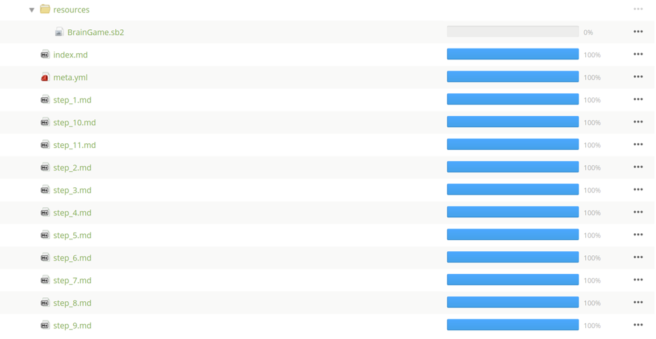

1. You can review a file by opening it in Proofreading Mode: click on the three dots located to the right of the file’s progress bar, and select **Open in Proofreading Mode**.

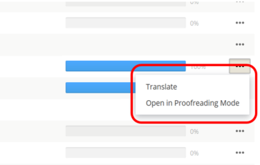

2. The file will open in the Crowdin Editor. The English source text will be on the left (1) and its translation on the right (2).

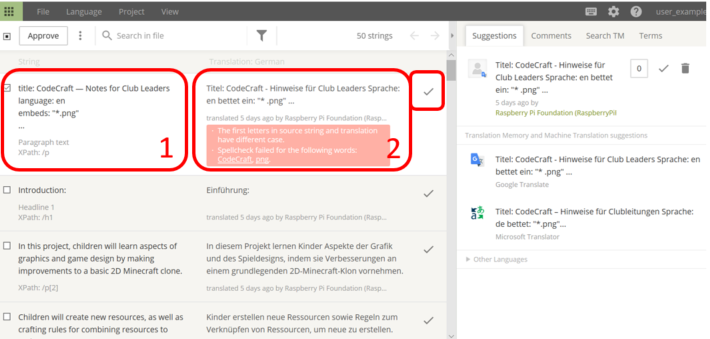

3. If you are happy with a translated segment, click the tick icon to the left of the translated text to approve it. A red box will warn you if there are issues with the translation, for example if tags are missing or if the punctuation in the translation is different from the original. Please read any warnings carefully and act accordingly — if you have any questions, contact Nina at nina@raspberrypi.org. 

4. If you need to change a translation, click on the translated text and make your changes.

5. After approving all translated segments of the file, you can exit Crowdin Editor by clicking the green icon in the top left-hand corner of the screen.

6. Select another file for review until you have approved all translations in the project. You can track your progress using the review progress bars next to the files – look out for green colour (blue indicates translation progress). Hovering over the progress bar with your mouse will show you more details.

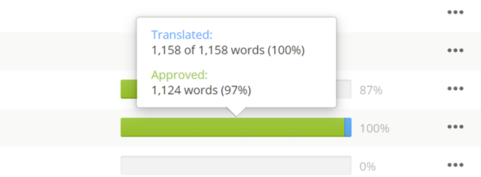

For more information on using Crowdin Editor, please see: 
https://support.crowdin.com/online-editor/
