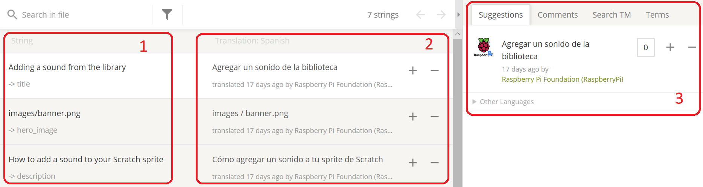
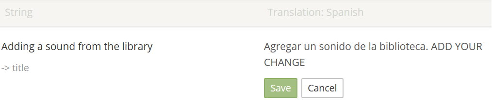
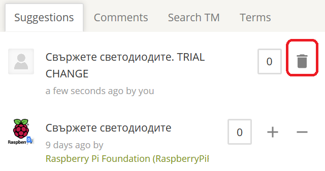

# How to use Crowdin

Click the Crowdin link provided to you by your coordinator and you will be taken to the project’s Crowdin page:

You will see language icons in the form of flags. Click the icon for your language, and you will be taken to a screen looking like the image below. Here you’ll find all the files within the project that need translating (we explain how to approach translating the different types of files [here](https://github.com/ninaszymor/Raspberry-Pi-Translation-Guide/blob/master-professionals/Tools/Files%20in%20Crowdin.md) - please **read this carefully**). Note the progress bars on the right, which indicate the progress of translation (blue) or review (green).

## Translating files

If the progress bar next to the file is empty, it means the file has not been translated yet. You will need to open th file in **Translation Mode** Click the three dots next to your chosen file’s progress bar and select **Translate**. 

+ You will be taken to Crowdin Editor

+ In the left-hand panel (1), you will see the English source text. The heading of the section to be translated is highlighted in yellow (here it is ‘Introduction’), and the segments of the text that are not yet translated are highlighted in red.

+ Click on a segment to select it for translation. The selected segment will appear in the top middle panel (2), which is the translation area where you can add/edit the translation. 

+ Some words in the translation area might be underlined with a dotted line, which means that there is a glossary entry for that word:

+ Hover over the word with your mouse to see the suggestion. It might be a tip on how to translate the word, or a reminder for you that the word should not be translated:

+ Remember that you will be dealing with various types of files (e.g. .yml or .md), each of which needs to be addressed differently - please read [this document](https://github.com/ninaszymor/Raspberry-Pi-Translation-Guide/blob/master/Tools/Files%20in%20Crowdin.md) to know what to do.

+ When you’re happy with your translation, click **Save**. As soon as you translate and save a segment, its colour in the left-hand panel will change to green:

+ The next segment of the text will automatically appear in the translation area. If the segment is untranslatable (for example, it’s a name of a file or a URL), you can click the **Copy source** icon at the bottom of the translation area: 

+ The bottom panel in the middle of the screen (3) offers you suggestions for your translation, which are based on our previous translations, Crowdin global translation memory, or machine translation. Feel free to use the suggestions, but please be careful and always review them, as they may contain errors or may be unsuitable for your context. Click on a suggestion to select it, and it will be added to the translation area automatically.

+ You can add comments or questions relating to a given segment in the panel on the right (4).

+ After you translate and save the last segment in the file, the following pop-up window will appear:

+ Clicking **Open Next** will open the next file in the folder, while clicking **Select Another File** will allow you to select a different file from the folder. To continue working on the current file, close the window by clicking on the X in its top right-hand corner.

+ When you're finished with translating, you can exit the Crowdin Editor by clicking the green icon in the top left-hand corner of the screen:

+ Some file types (e.g. .sb2) cannot be translated within the Crowdin Editor and therefore need to be downloaded. To download a file, click on its name as usual. You’ll be taken to the Crowdin Editor, and as you won’t be able to translate the file there, download it by clicking Download in the upper right-hand corner (see the image below). Then translate it on your computer, and upload it back to Crowdin.

## Post-editing files: machine translation

If the progress bar is blue, it means the file has been pre-translared with machine translation. If that's the case, click the three dots next to your chosen file’s progress bar and select **Open in Voting Mode**. 

+ You will be taken to Crowdin Editor:

+ The English source text will be on the left (1) and its machine translation on the right (2).

+ If you are happy with the machine translation, click + to approve it (2).

+ If you need to change a translation, click the - to indicate that machine translation is wrong (2). Then, click on the translated text (in 2) and make your changes. Click **Save**:

+ When you save a change, it will be added to the list of suggestions in the panel on the right. If you later decide that you need to change your own suggestion, please remember that it will be saved as a separate suggestion. If this happens, please delete your first suggestion by clicking the bin icon next to the old suggestion you no longer want to make (in 3):

+ Sometimes, machine translation will translate things that should be left in English, such as code, tags, brand names, and so on - you will need to change those back to English. Our [instructions](https://github.com/ninaszymor/Raspberry-Pi-Translation-Guide/blob/master-v2/Tools/Files%20in%20Crowdin.md) explain how to deal with translating different types of files and how to approach code, tags, etc.

For more information on using Crowdin Editor, please see: 
https://support.crowdin.com/online-editor/
