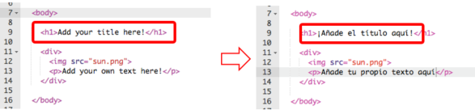
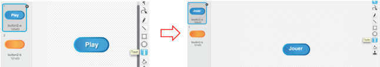

# Translating different types of files in Crowdin

When you open a project in Crowdin (by clicking the relevant link in Task Manager) and choose your language from those available, you will see the project folders and files:

The main folder is called **master** and it contains a folder called **en** where you'll find all of the project folders and files that need translating:

- **Images** folder contains graphic files and videos/gifs that visualise the various steps in the project instructions. Graphic files should be translated whenever they contain text. 
- **Resources** folder contains files with the project's initial code (if any) that learners begin with, as well as the finished project file. The files are made available for those who cannot complete the projects online so they have to be translated. 
- **yml file** - add description of what yml file does.
- **markdown (.md) files** contain the textual instructions for learners that are displayed on the website. They **should be translated**.

Below, we explain how to approach translating these different files.

## Project code

We recommend that you begin with translating the files in the **Resources** folder, which contain the project code. This is because you can then use this code to translate screenshots (see **graphic files**) and you can make sure that the project instructions refer to the translated code (see **markdown files**). This way, everything will be consistent and there will be no confusion for the learners. 

### Python files

There are three options for translating Python (.py) files:

- You can open them in Crowdin Editor and translate there.
- You can download the Python file to your computer and translate it offline. You will have to save the file under the same name as the English source and then upload it back to Crowdin Editor when you're done.
- You can copy the code into an empty Trinket and translate it there. You will then need

Python (.py) files can be opened in Crowdin Editor and translated there. 
Please make sure that you run the code to check that it works.

### Scratch files (.sb2)

Please make sure that you run the code to check that it works.

### HTML, CSS & JavaScript

Please make sure that you run the code to check that it works.

## Graphic files

This folder contains graphic files and videos/gifs that visualise the various steps in the project instructions. Graphic files should be translated whenever they contain text. 

- Most of the time, images will show the project code or the results of the code being executed:

- For Scratch projects, graphic files will mostly include screenshots of Scratch Editor. You can use the Scratch page you translated earlier but it only contains initial code (or no code at all) so you will have to recreate some of the steps - please follow the project instructions. Alternatively, you can first translate the finished project file (see **resources foler** below) and re-use the code from that file to take screenshots. 

- Some translated images will need to be edited, for example, the screenshot below has some red circles and a red arrow added. Please save the screenshot of the translated Trinket on your computer and make the required edits in an image editing program, e.g. Paint.

- Some projects use a Raspberry Pi which means you will need access to one to recreate the screenshot. We will leave you a note in the Comments column of the Task Manager so you know not to translate the project if you don't have access to a Raspberry Pi. 

- When your translated images are ready, please upload them via Crowdin Editor to replace the English source file.

- Ideally, GIFs and videos would also be translated but this involves significant amount of work so we don’t expect you to do it. If you decide to translate them but don't know how, please contact Nina (nina@raspbrrypi.org). 

## GIFs

xxx

## Python files

This folder contains all the resources (including an example of a finished project) that an educator might need to teach the project offline. Python files (.py), Scratch files (.sb2), HTML files (.html) and graphic files that contain text **should be translated**. All other files should be ignored.

- Python files can be opened and translated via Crowdin Editor. Please make sure your translations are in line with your translated Trinket.

- Scratch files need to be downloaded via Crowdin Editor and either translated offline if you have the offline Scratch Editor installed or uploaded to the online Scratch Editor and translated there. Please make sure your translations are in line with your translation of the initial Scratch code.

- HTML files can be opened and translated via Crowdin Editor, which conveniently hides all HTML tags so you'll only see the displayable content. Please make sure you translate it in line with your translated Trinket. 

- Any graphic files should be treated in the same way as those in the **images** folder.

## Scratch files

## HTML files

## CSS files

## JavaScript files

## yml file

Some segments in this file **should be translated**. Please translate the following lines:

- title
- description
- steps

Please **do not translate** the following segments:

- hero_image
- theme
- duration
- listed
- ingredient
- copyedit
- curriculum
- original_url
- interests
- technologies
- site_areas

The name of the segment is displayed in the translation aread, under **context**:

## Markdown (.md) files

These files contain the textual instructions for learners that are displayed on the website and **should be translated**. They will often refer to the different programming languages that the resources teach so please make sure your translations of these references are in line with your translation of the project code in Trinket/Scratch page, in the finished project files from the resources folder, and the screenshots.

Markdown files also contain a number of elements that **should not be translated**:

- Text between **triple square brackets** or **triple dashes** is part of the markdown content that our system needs to be able to recognise in order to take certain actions. Please **do not translate** it:

- •	The words **_title_**, **_screenshot_** or **_image_** in the contexts shown below are also part of markdown content. Please **do not translate** them:

- Please **do not translate** the markdown content in **curly brackets** {}, like here: 

When translating segments with markdown content in curly brackets, please make sure you add the curly brackets in the correct place and that you do not add a space between the opening curly bracket and the word that it follows.

- Some segments, such as **names of graphic files** or **URLs**, will be marked as **Hidden Strings**. Please **do not translate** them. 

- Markdown files contain **tags** that are used to format the text (e.g. to make it bold, underline it, italicize it), to add a hyperlink, to mark a given line of text as code, and so on. Crowdin replaces these tags with these symbols: `<0> </0>`. If you see these symbols in the source segment, please make sure you include them in your translation in the correct place (and please do not change their order): 

## Questions and problems

If you have any questions or problems when translating Web Development projects, you can post a question on Crowdin, email your fellow translators, or get in touch with Nina (nina@raspberrypi.org).
