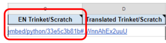

# How to use the Task Manager

If you are available to help us with a project, go to [Task Manager](https://docs.google.com/spreadsheets/d/1vqu2VDPIA0C-UW6pMSsoS6UsUyzry7paspLV63hkqhs/edit?usp=sharing), select your language from  among the tabs at the bottom of the spreadsheet (see below), and look up the project’s name.

Then type in your name in the spreadsheet cell labelled with the task that you have taken on: **Translation**, **Review**, or **Testing**.

We make tasks available on a first come, first served basis, so if the relevant cell already contains a name, it means that someone else has taken on the project. In such a case, please do not replace their name with yours.

## For translators

If you’re a translator and have added your name to the Task Manager, you can start translating straight away. When you start translating, please set the **Translation status** cell to **In progress** (see below) to let us know that you’ve begun the task. Once you’ve finished, please set the cell to **Finished** to let the reviewer know that they can start their job.

We recommend you begin with translating the initial project code in [Trinket](https://github.com/ninaszymor/Raspberry-Pi-Translation-Guide/blob/master/Tools/Trinket.md)/[Scratch](https://github.com/ninaszymor/Raspberry-Pi-Translation-Guide/blob/master/Tools/Scratch.md). You can find a link to your chosen project's Trinket/Scratch in the **EN Trinket/Scratch** column in Task Manager:

Once the initial code has been translated, you can start translating project intstructions in [Crowdin](https://github.com/ninaszymor/Raspberry-Pi-Translation-Guide/blob/master/Tools/Crowdin.md). To open your chosen project’s instructions in Crowdin, click the **Link for Translation** in the Task Manager:

The project instructions will frequently mention code of Trinket/Scratch so please make sure you translate the code in the same way in both places.

## For reviewers

Before you start reviewing, please wait for the **Translation status** cell in Task Manager to be set to **Finished**. Once you’ve begun your review, set the **Review status** cell to **In progress**, and to **Finished** when appropriate.

- To review the translation of the **initial project code** in Trinket/Scratch, please use the **Translated Trinket/Scratch** link in Task Manager. If you make any changes, please make sure you update the translated link in the Task Manager.

- To review the translation of the project instructions, please use the **Link for review** (as above).

## For testers

Before you start testing, please wait for the **Review status** cell in Task Manager to be set to **Finished**. Once you’ve begun your test, set the **Testing status** cell to **In progress**, and then to **Finished** when appropriate.

- In the **Link for test** column, we will provide a link to a test version of the project that we’ll have generated for you. Please go through the project step by step to make sure it works well and that there are no problems along the way.

- If you come across issues that make it difficult or impossible to progress with the project, please let us know: select the **Issues found** option in the **Testing Feedback** cell in Task Manager, and fill in a report form (you can access it by clicking [here](https://docs.google.com/forms/d/e/1FAIpQLSd1136TVh8zdM7u8k3U1a6XXCq0H-yrhYp-YbvP36pLiun6Bg/viewform?pli=1) or clicking on the **Testing Feedback** cell in the Task Manager and following the hyperlink).

## Other information

The Task Manager contains some other helpful information, such as:

- Link to the published version of the English project (if available) - click on the project's name to access the hyperlink.
- Project's category - this is most likely going to be Python, Scratch or Web development.
- Priority - please prioritise projects that are marked as HIGH priority.
- Deadline - this indicates when we need the translation to be ready.

