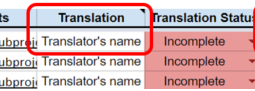
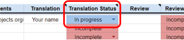
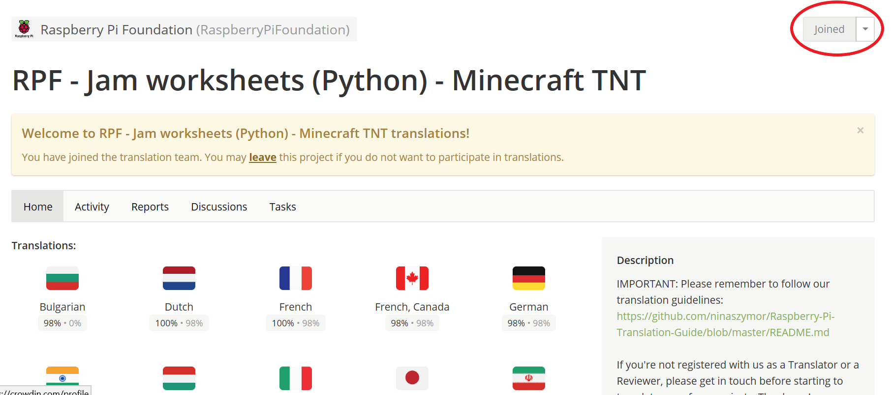
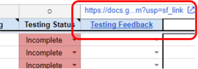

# How to use the Task Manager

If your volunteers are ready to translate, go to Task Manager (you should have received the link from our translation manager), select the language(s) from  among the tabs at the bottom of the spreadsheet (see below), and look up the project’s name.

Then type in the **name of the volunteer** *AND* **your organisation's name** in the spreadsheet cell labelled with the task that you have taken on: **Translation**, **Review**, or **Testing**. This will mke it possible for us to verify your volunteers' contributions in Crowdin. For quality control purposes, we will delete any Crowdin contributions that we cannot identify because the contributor's and organisation's names are not listed in the Task Manager.

Please do not add the same name under more than one step for the same project - we want different volunteers to perform the translation, review and testing of a project.

We make tasks available on a first come, first served basis, so if the relevant cell already contains a name, it means that someone else has taken on the project. In such a case, please do not replace their name with yours.

## For translators

Volunteers doing post-editing of machine translation should be provided with **Link for Translation**. When they start translating, please set the **Translation status** cell to **In progress** (see below) to let us know that they’ve begun the task. Once they finish, please set the cell to **Finished** to let us know the review will begin.

Note: Once a volunteer uses the **Link for Translation** they will be assigned the role of **translator** permanently and won't be able to review a project even if they use the **Link for Review** (see below). If for some reason they need to change they role to **reviewer**, they will need to leave the project (see screenshot below) and join again via the **Link for Review**.

## For reviewers

When the translation is ready, the review can begin. Once a volnteer has begun the review, set the **Review status** cell to **In progress**, and to **Finished** when appropriate. You should provide the volunteer with the **Link for review** (as above).

## For testers

In the **Link for test** column, we will provide a link to a test version of the project that we’ll have generated. Please provide the volunteer tester with the link and ask them to go through the project step by step to make sure it works well and that there are no problems along the way.

- If they come across issues that make it difficult or impossible to progress with the project, please let us know: select the **Issues found** option in the **Testing Feedback** cell in Task Manager, and fill in a report form (you can access it by clicking [here](https://docs.google.com/forms/d/e/1FAIpQLSd1136TVh8zdM7u8k3U1a6XXCq0H-yrhYp-YbvP36pLiun6Bg/viewform?pli=1) or clicking on the **Testing Feedback** cell in the Task Manager and following the hyperlink).

## Other information

The Task Manager contains some other helpful information, such as:

- Link to the published version of the English project (if available) - click on the project's name to access the hyperlink.
- Project's category - this is most likely going to be Python, Scratch or Web development.
- Priority - please prioritise projects that are marked as HIGH priority.
- Deadline - this indicates when we need the translation to be ready.

